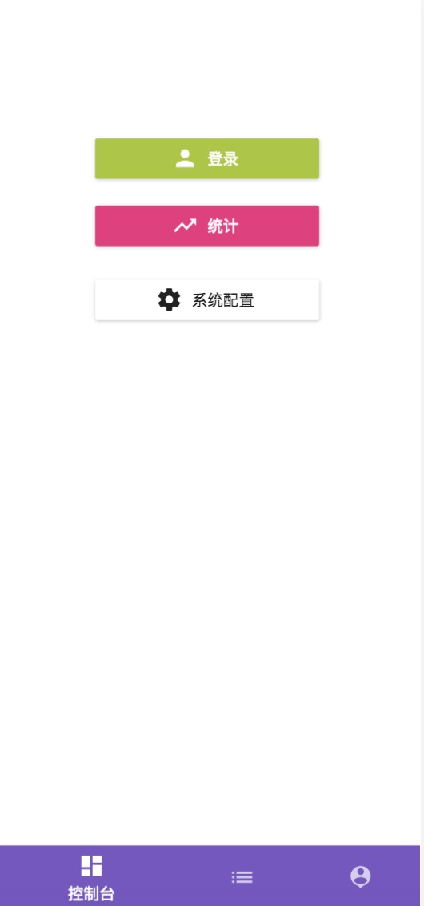

# wechat-laravel-lavas-system【WLLS】
主要目的是在微信小程序系统的搭建初期，方便快速构建，前后台页面基本框架，基本的用户注册登录和图片/视频等资源的上传以及微信支付。


主要功能：

* Laravel提供API基础功能（用户，七牛，微信支付，等）
* Lavas后台admin网站登录使用微信小程序授权，并支持权限管理
* 微信小程序用户自动注册和登录
* Lavas集成UI插件（mint UI,muse UI）,兼容PC和移动前端

# 写在最前：
参考和使用的git代码：

[laravel-boilerplate]

[laravel-boilerplate]: https://github.com/francescomalatesta/laravel-api-boilerplate-jwt


[小程序授权登录思路参考]

[小程序授权登录思路参考]: https://blog.csdn.net/P6P7qsW6ua47A2Sb/article/details/78892430

[微信小程序二维码官方介绍]

[微信小程序二维码官方介绍]: https://developers.weixin.qq.com/miniprogram/dev/api/qrcode.html

[Lavas百度官方介绍]

[Lavas百度官方介绍]: https://lavas.baidu.com

另外，希望你是知道什么是laravel，lavas等，或者知道一些开源框架的基本使用。

(详细编写中...)

# 环境安装

基础环境要求:

php7.1

composer

npm

laravel（https://laravel.com/docs/5.6/installation）

lavas（https://lavas.baidu.com/guide/v2/basic/install）

nodejs


# 代码运行
## Laravel:


   进入laravel目录

```
cd laravel
```

### 1配置config

1. .env文件

   拷贝.evn.example为.evn，并修改关键参数：

   数据库mysql （提前创建一个空的数据库db，不需要创建table）

   APP_NAME

   JWT_SECRET(手动改一下，或者生成，或者不改)

   APP_KEY（手动改一下，或者生成，或者不改。php artisan key:generate）

### 2安装依赖库

```
   composer install
```

### 3生成基础数据库migration

   (先确保数据库db已经创建)

```
php artisan migrate
```

### 4配置自己平台的参数

   目录：/laravel/config/

   七牛配置：qiniu.php

   微信配置（小程序和支付）：weixinpay.php

### 5对外api route说明

   目录：laravel/routes/api.php 支持的api route列举在其中

   （我关闭了标准的login/signup之类的api，因为微信小程序中使用wx.login自动注册登录【下面详细说】）

### 6本地测试。

   建议使用valet（参见官方:https://laravel.com/docs/5.6/valet）

   访问: http://[域名]/api/hello 如果可以访问则运行正常

### 7部署到服务器

   整个laravel目录需要拷贝到服务器。配置php环境。
   由于一般不会把vendor的依赖库和.evn 发布到您的git仓库。所以需要进入服务器把.evn 文件和vendor重新生成。
   也就是：
   ```
   拷贝.evn.example为.evn，并修改关键参数
   ```
   ```
   composer install
   ```
   ```
   注意：laravel/public 为网站服务器的root根目录[这些属于laravel的基本操作，其他的操作不赘述了]
   ```

## lavas后台架构

###  1安装lavas

   参考lavas官方网站的步骤

   ```
   npm install lavas -g
   ```
### 2进入lavas目录

 ```
 cd lavas
 ```

### 3安装依赖库

```
npm install
```

### 4修改配置

   （可选）关注本地测试时的api proxy【lavas/server.dev.js中的proxyTable】

### 5本地测试

```
lavas dev
```

   访问http://localhost:3000/ 如果正常，则成功

   

### 6说明

   当前只实现了‘登录’按钮功能（即授权登录）

### 7后台admin授权登录设计
参考附件：《微信小程序授权登录设计-0609.pptx》

### 8部署到服务器

```
lavas build
```

   生成dist/目录,该目录为需要发布到您服务器网站

## 微信小程序

   基于微信官方开发工具生成的代码框架。

### 1修改参数

   wechat/config.js中api域名和七牛域名
   ```
   var host = 'https://api.abc.com';
   var qiniudomain = 'https://qinius.abc.com';
   ```

   wechat/project.config.json中微信小程序appid和project name
   ```
   "appid": "xxxxxxxxxxxxxx",
   "projectname": "WLLxcx",
   ```

### 2关键代码说明

   自动登录(wechat/app.js)

   ```
   wx.login({
     success: res => {
       // 发送 res.code 到后台换取 openId, sessionKey, unionId,但api并不会返回openid，而是直接自动登录，返回用户信息。并且自动注册和登录
       wx.request({
         url: config.service.requestUrl+'/wxlogin/'+res.code, //仅为示例，并非真实的接口地址
         data: {
         },
         header: {
           'content-type': 'application/json' // 默认值
         },
         method: 'GET',
         success: function(res) {
           console.log('wx.login---res==',res.data);

           if(res.data.status=='ok'){
             var ret = res.data.ret;
             _this.globalData.iflogin = true;
             _this.globalData.apitoken = ret.token;
             _this.globalData.userInfo = ret.userinfo;
             if (this.apiloginCallback) {
               this.apiloginCallback()
             }
           }else{
             _this.globalData.iflogin = false;
             _this.globalData.apitoken = '';
             _this.globalData.userInfo = null;
           }
         }
       })

   ```      
    注意代码段中的wx.request的使用，以及返回值。请对应去laravel API代码中controller对应的代码处理。
    
